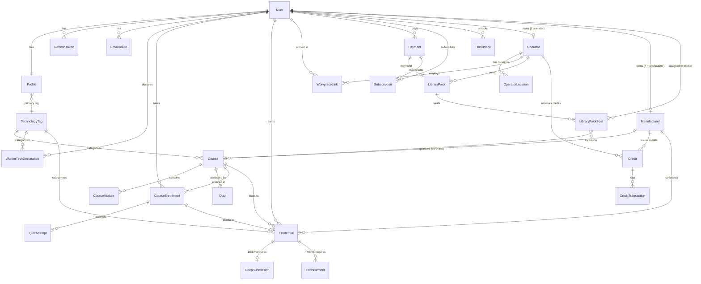

# QUIPP Entity-Relationship Design

**Status:** Living document. Updated as milestones land.
**Source of truth for the product spec:** [../frontend/QUIPP_Build_Prompt_v2.1.md](../frontend/QUIPP_Build_Prompt_v2.1.md)
**Last updated:** M2 planning (auth-flow + ERD)

## Milestone legend

- **[M1]** shipped — authentication core
- **[M3]** wire-real-data milestone — Passport, Academy, credentials off mock data
- **[M4]** course completion + credential issuance
- **[M5]** operator dashboard + workplace links
- **[M6]** Stripe payments (worker + operator + manufacturer)
- **[M7]** manufacturer portal (stubbed at MVP per spec)
- **[LATER]** post-MVP — QUIPPY AI, pain-based community, title unlocks

## Overview

QUIPP is a three-sided marketplace: **Workers** earn credentials, **Operators** (restaurants) assign training and hire, **Manufacturers** sponsor certifications. A single `User` can hold any combination of the three roles. Credentials are permanent, owned by the worker, and portable across employers — this is the product's core promise and drives most of the schema decisions.

## Entity map

## Entities

### Identity

#### User [M1 shipped]
The authentication account. One per human.

| Field | Type | Notes |
|---|---|---|
| _id | ObjectId | primary key |
| email | string | unique, lowercased |
| passwordHash | string \| null | null when only OAuth |
| firstName, lastName | string \| null | collected at signup |
| emailVerifiedAt | Date \| null | set when verify email token consumed |
| roles | AppRole[] | subset of `worker` / `operator` / `manufacturer` / `admin` |
| googleId, facebookId | string \| null | populated at OAuth link (M2) |
| lastLoginAt | Date \| null | |
| createdAt, updatedAt | Date | auto |

#### Profile [M3]
Public identity layer on top of `User`. Split from `User` because it is publicly readable (public passport URL) while `User` is not.

| Field | Type | Notes |
|---|---|---|
| _id | ObjectId | |
| userId | ObjectId → User | unique |
| username | string | unique, URL-safe, `quipp.co/p/{username}` |
| avatarUrl | string \| null | |
| techProficiencyScore | int | 0–100, **derived** — recomputed on credential change |
| techScoreLabel | enum | BUILDING / ESTABLISHED / RECOGNISED / AUTHORITY, derived from score |
| visibilityStatus | enum | `open` / `employed` / `private` — worker-controlled |
| baseRole | enum | Kitchen / Bar / Floor / Management / Ownership |
| techRole | string | derived title like TechChef, TechBarista |
| specialty | string \| null | |
| yearsExperience | int | |

#### RefreshToken [M1 shipped]
Rotating refresh tokens for session persistence.

| Field | Type | Notes |
|---|---|---|
| userId | ObjectId → User | |
| tokenHash | string | SHA-256 of the raw token |
| expiresAt | Date | TTL-indexed |
| revokedAt, replacedByHash | Date \| null, string \| null | rotation trail |
| userAgent, ip | string \| null | audit |

#### EmailToken [M1 shipped]
Single-use tokens for email verification and password reset.

| Field | Type | Notes |
|---|---|---|
| userId | ObjectId → User | |
| tokenHash | string | SHA-256 of the raw token |
| purpose | enum | `verify_email` / `password_reset` |
| expiresAt | Date | TTL-indexed |
| usedAt | Date \| null | consumed-once |

### Taxonomy

#### TechnologyTag [M3]
Fixed 5 seeded values. Every course, credential, and equipment declaration carries one.

| Field | Type | Notes |
|---|---|---|
| tagName | enum | `THERMAL` / `COLD` / `BEVERAGE` / `DIGITAL` / `SERVICE` |
| description | string | |
| active | boolean | soft-hide |

#### WorkerTechDeclaration [M3]
Equipment a worker declares they use daily. Feeds QUIPPY relevance + manufacturer targeting (Path B credits).

| Field | Type | Notes |
|---|---|---|
| userId | ObjectId → User | |
| equipmentName | string | e.g. `Rational SelfCookingCenter` |
| brand | string | e.g. `Rational` |
| tagId | ObjectId → TechnologyTag | |
| verified | boolean | true if operator confirmed |
| declaredAt | Date | |

### Learning

#### Course [M3]
A learnable unit. Each course targets one tier (IN/DEEP/THERE) and one tag. IN → DEEP → THERE for the same topic are three separate `Course` rows.

| Field | Type | Notes |
|---|---|---|
| slug | string | unique, URL-safe |
| title | string | |
| techFocus | string | free text |
| tagId | ObjectId → TechnologyTag | |
| tier | enum | `IN` / `DEEP` / `THERE` |
| duration | int | minutes |
| description | string | |
| provider | string | e.g. `Thinkific-hosted` |
| isManufacturer | boolean | true if co-branded course |
| equipmentName | string \| null | targeted equipment (drives Path B) |
| passMark | int | default 80 |
| retakeCooldownHours | int | default 24 |
| techScoreContribution | int | added on completion |
| status | enum | `published` / `coming_soon` |
| externalUrl | string \| null | Thinkific/Teachable course URL |
| priceCents | int | 0 if free |
| stripePriceId | string \| null | M6 |

#### CourseModule [M4]
Optional local mirror of course chapters, only used if we track fine-grained progress. May remain empty if Thinkific handles it.

#### CourseEnrollment [M3]
A user's access to and progress on a specific course. This is the "who can take what" gate.

| Field | Type | Notes |
|---|---|---|
| userId | ObjectId → User | |
| courseId | ObjectId → Course | |
| status | enum | `in_progress` / `completed` / `failed` |
| startedAt, completedAt | Date | |
| progressPct | int | 0–100 |
| sourceType | enum | `paid` / `library` / `manufacturer_credit` / `free` |
| sourceId | ObjectId \| null | Payment / LibraryPackSeat / Credit id depending on sourceType |

#### Quiz [M4]
One quiz per course.

#### QuizAttempt [M4]
Every user attempt is recorded so we can enforce cooldowns and audit trails.

### Credentials

#### Credential [M3]
The permanent record of an earned certification. **Cannot be revoked** by an employer.

| Field | Type | Notes |
|---|---|---|
| userId | ObjectId → User | |
| courseId | ObjectId → Course | |
| courseName | string | denormalized for display resilience |
| tier | enum | `IN` / `DEEP` / `THERE` |
| tagId | ObjectId → TechnologyTag | |
| provider | string | |
| isManufacturer | boolean | |
| coBrandLogoUrl | string \| null | |
| earnedDate | Date | |
| verificationId | string | unique, printed on badge as `QUIPP-XXXXXXXX` |
| quizScore | int | |
| skillsDemonstrated | string[] | |
| techScoreContribution | int | |
| status | enum | `active` / `update_available` |
| sourceType | enum | mirrors CourseEnrollment.sourceType — drives operator visibility rules |
| sourceOperatorId | ObjectId \| null | if issued via a specific operator's library |

#### DeepSubmission [M4]
Supervisor confirmation flow. A DEEP credential is only issued after the QUIPP team reviews the supervisor text (spec §CREDENTIAL SYSTEM).

#### Endorsement [M4]
THERE tier requires a verified endorsement from an operator or manufacturer.

#### TitleUnlock [LATER]
CHAMPION ChefTech / THERMAL SPECIALIST / DIGITAL OPERATOR / FOH LEAD — automatic recognition of credential combinations. Fake manually at MVP per spec.

### Organizations

#### Operator [M5]
A restaurant / hospitality business. Owned by a `User` (the account owner). Distinct entity so the business identity is stable across employee changes.

| Field | Type | Notes |
|---|---|---|
| ownerUserId | ObjectId → User | |
| companyName | string | |
| hqLocation | string | |
| logoUrl | string \| null | |

#### OperatorLocation [M5]
Multiple locations per operator. Location-code appears in the operator dashboard.

#### WorkplaceLink [M5]
The formal worker↔operator relationship. Encodes the spec's hard-coded privacy rules by carrying a status enum, alumni flag, and visibility-ends-at date.

| Field | Type | Notes |
|---|---|---|
| workerId | ObjectId → User | |
| operatorId | ObjectId → Operator | |
| locationId | ObjectId → OperatorLocation \| null | |
| status | enum | `pending` / `active` / `unlinked` |
| alumni | boolean | true after unlink |
| operatorVisibilityEndsAt | Date \| null | immediately on unlink |
| requestedAt, confirmedAt, unlinkedAt | Date \| null | |

**Privacy note:** operator visibility filtering happens at the query layer, not the schema. When listing a linked worker's credentials for an operator: `sourceOperatorId == operator._id OR sourceType == 'library' AND libraryOperatorId == operator._id`. Everything else is invisible.

#### Manufacturer [M6]
An equipment brand (Rational, UNOX, Taylor, La Marzocca, etc.). Optional `ownerUserId` for when a manufacturer employee has a login.

### Commerce

#### Payment [M6]
Every Stripe charge lands here.

#### Subscription [M6]
QUIPPY Premium ($9.99/mo, $89/yr) and Manufacturer annual partnerships.

#### LibraryPack [M6]
An operator's seat pack (7 SKUs: Small Dept / Medium Dept / Large Dept / XL Dept / Full Location Small/Medium/Large).

#### LibraryPackSeat [M6]
A single seat within a pack, assignable to one worker for one course.

#### Credit + CreditTransaction [M6]
Manufacturer-issued credits + audit log. Supports the three credit paths in the spec (A: Manufacturer → Operator → Worker, B: Manufacturer → Self-Declared Worker, C: Operator direct).

### QUIPPY (AI) — LATER

`Conversation`, `Message`, `ProactiveTrigger`, `QuippyKnowledgeBase`. Deferred entirely for MVP; basic Equipment Consultant chat is the only piece considered near-term.

### Community — LATER

`PainRecord`, `MatchAttempt`, `ConnectionTracking`. Pain-based matching between workers. Deferred.

## Cross-cutting rules

- **Credentials are permanent.** No DELETE on the `credentials` collection. Even if a user unlinks from an operator, their credentials survive.
- **Tech proficiency score is derived.** Formula from spec: `breadth * 30 + depth * 30 + recency * 20 + endorsement * 20`, normalized to 0–100. Recomputed on credential CREATE / UPDATE via a small pure function `computeTechScore(credentials)` — not stored raw, but cached on `Profile` for fast reads.
- **QUIPPY conversations are worker-private.** Even if `WorkplaceLink` is active, operators never see conversation history. Enforced at the API layer — no query ever joins conversations against workplaces.
- **One user, many roles.** `roles: AppRole[]` on User handles the "operator who also learns on QUIPP" case cleanly.
